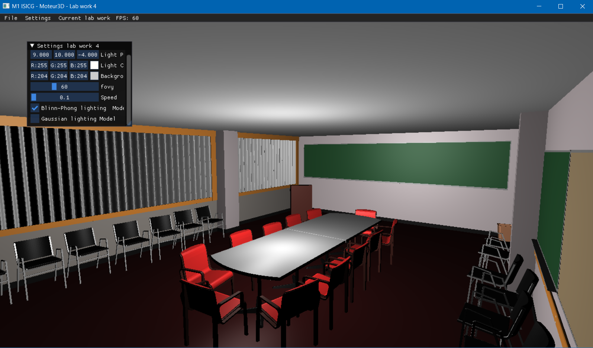
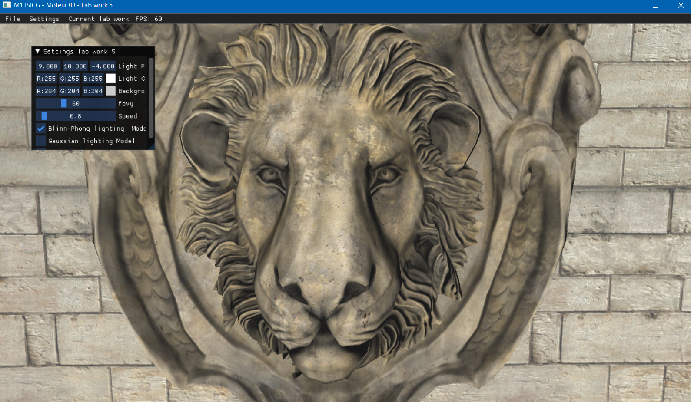
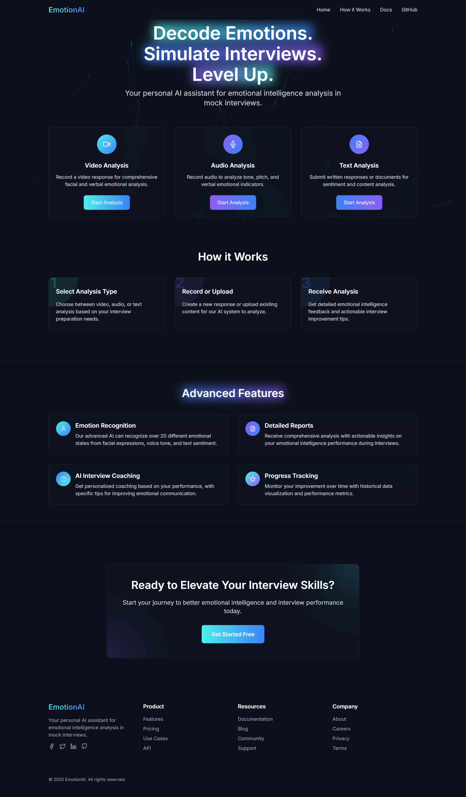
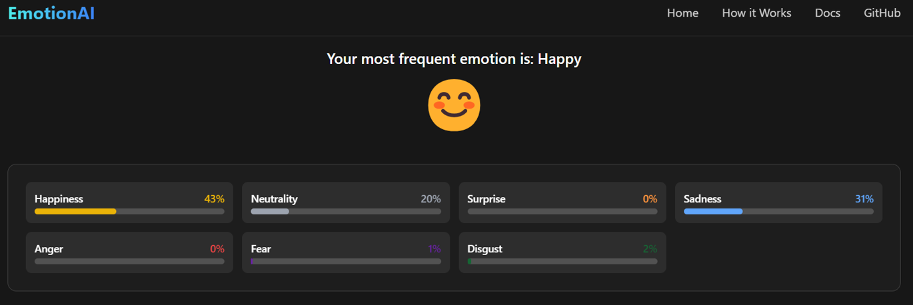
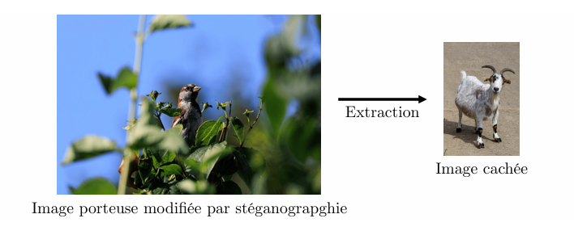
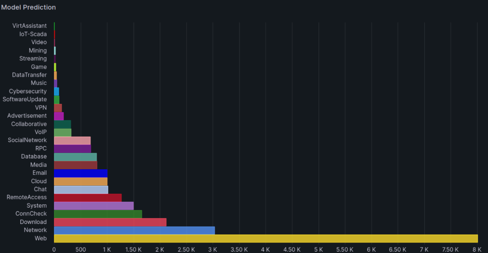
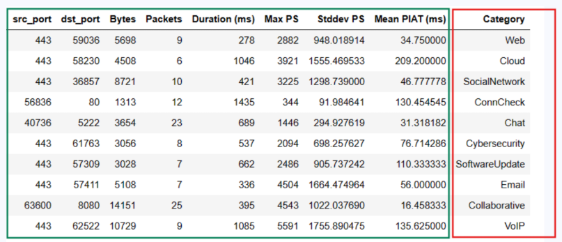

## Hi there 👋

# 💫 About Me:
Je m’appelle Maram Abbassi, étudiante en Master 2 Informatique – Synthèse d’Images et Conception Graphique (ISICG) à la Faculté des Sciences et Techniques de Limoges. Ce master forme aux domaines du graphisme temps réel, de la vision par ordinateur, des moteurs 3D, du traitement d’images, ainsi qu’aux techniques avancées de rendu et de modélisation. 👉 Plus d’informations sur la formation : [unilim.fr/isicg.](https://www.sciences.unilim.fr/informatique/master-informatique-isicg/)  

## 🌐 Socials:
  
  

# 💻 Tech Stack:
                        

##  🎨Ce que je fais ces derniers temps:

# 🕹️ Jeu 3D Complet sous Unity

**C# – Unity 6.2 – Shaders – IA – Level Design**

Un projet complet de développement d’un jeu 3D incluant gameplay, intelligence artificielle, mécaniques avancées et shaders personnalisés.
L’objectif était de concevoir une expérience jouable de bout en bout, avec des systèmes autonomes et modulaires.

🔍 **Fonctionnalités principales**

IA ennemie : Patrouille dynamique | Détection du joueur (raycasts, FOV) | Système de boss avec comportements multiples.

Gameplay : Système de projectiles | Gestion de la santé | Résolution de puzzles interactifs | Objets utilisables contextuellement.

Graphisme : Shaders personnalisés (effets lumières, matériaux animés) | Interfaces UI adaptatives.

Architecture : Scriptable Objects | Événements | Gestion d’état.

🛠️ **Technologies**

Unity • C# • Shaders HLSL • Animation • NavMesh
  

# 🧱 Moteur 3D en OpenGL

**C++ – GLSL – Pipeline Graphique – Lancer de Rayon – Phong – Lambert – Rasterization – Surfaces implicites**

Développement d’un moteur 3D from scratch, en construisant progressivement toutes les étapes du pipeline graphique.
Ce projet m’a permis d’approfondir ma compréhension des transformations géométriques et des pipelines modernes.

🛠️ **Technologies**

C++ • OpenGL • GLFW • GLM • GLSL
  

  
  

# 😃 Reconnaissance Multimodale des Émotions (Vidéo + Audio + Texte)

**Deep Learning – CNN – LSTM – Flask – Altair – Temps réel**

Projet complet d’analyse des émotions combinant analyse faciale, analyse vocale et analyse linguistique.
L’application fonctionne en temps réel et affiche les prédictions avec visualisations interactives.

🔍 **Composants principaux**

Vision (Vidéo) : Détection de visage, extraction de features CNN.

Audio : MFCC + classification LSTM.

Texte : BERT / DistilBERT pour la prédiction d’émotions.

Frontend Flask : Enregistrement vidéo/audio | Graphiques Altair en direct.

🛠️ **Technologies**

Python • TensorFlow / PyTorch • OpenCV • Flask • Altair
  

# 🔐 4. Stéganographie d’Images accélérée GPU (CPU → CUDA)

**CUDA – Optimisation – Parallélisme – Traitement d’images**

Projet d’optimisation GPU d’un système de stéganographie par LSB.
Objectif : accélérer l'encodage/décodage à grande échelle via CUDA.

🔍 **Avancées clés**

Conversion CPU → CUDA avec parallélisation par octet.

Optimisations : Unrolling | Mémoire partagée | Pinned memory | Streams CUDA.

Analyse de performance : Speedup ×10 à ×20 selon les tailles d’images.

🛠️ **Technologies**

C++ • CUDA • Nvcc • Analyse de perf
  

# 🛰️ 6. Classification du trafic réseau en temps réel

**IA – DPDK – Kafka – NFStream – Monitoring**

Développement d’un système complet de capture, traitement et classification du trafic réseau basé sur des modèles ML optimisés.

🔍 **Points clés**

Pipeline DPDK → Kafka → NFStream.

Modèle ML pour la classification de flows.

Dashboard temps réel.

### ✍️ 

---

<!-- Proudly created with GPRM ( https://gprm.itsvg.in ) -->
